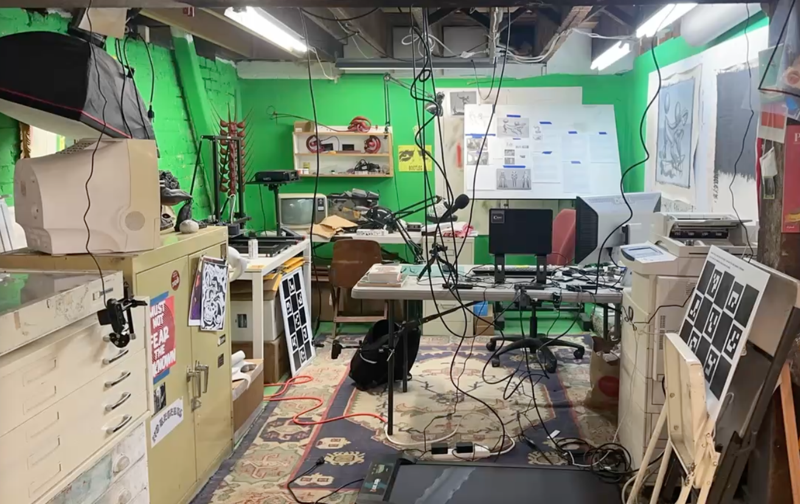
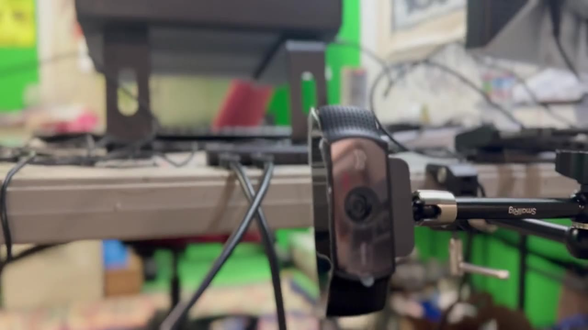
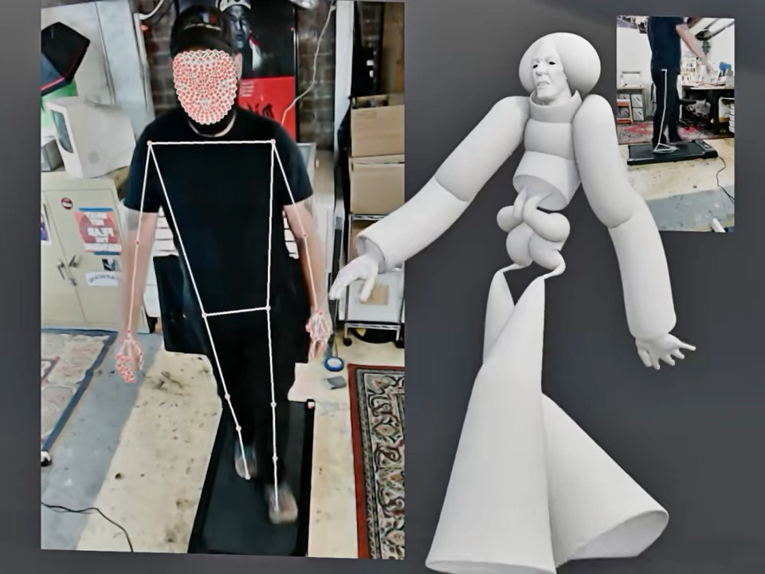
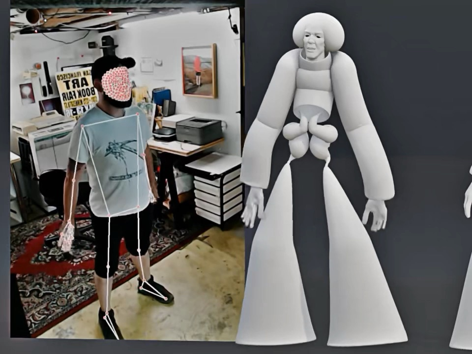
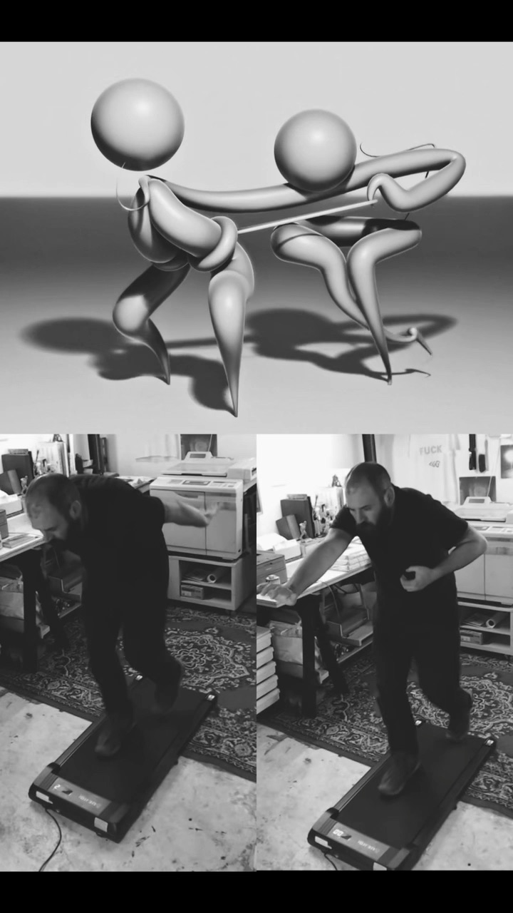
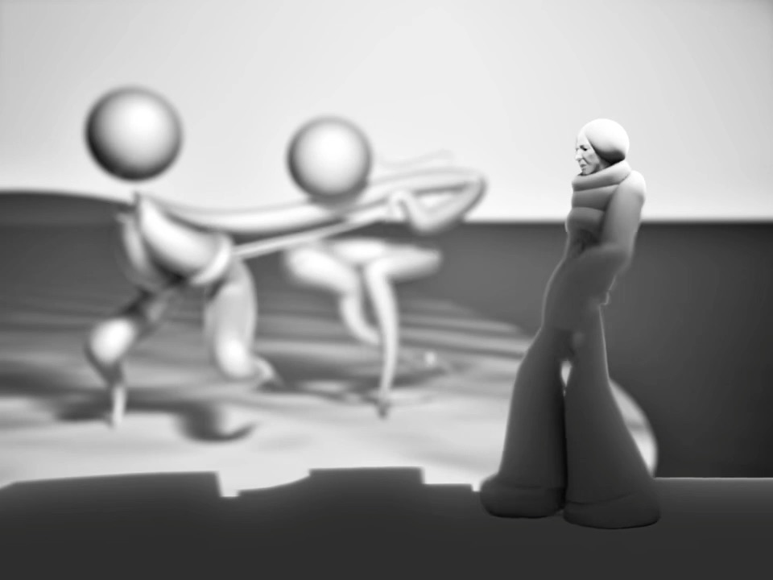
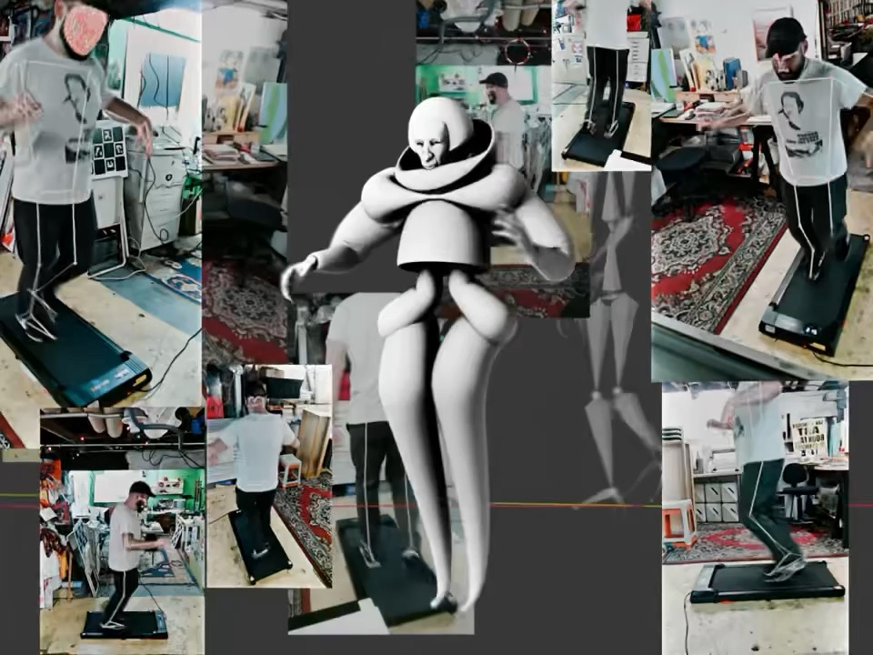
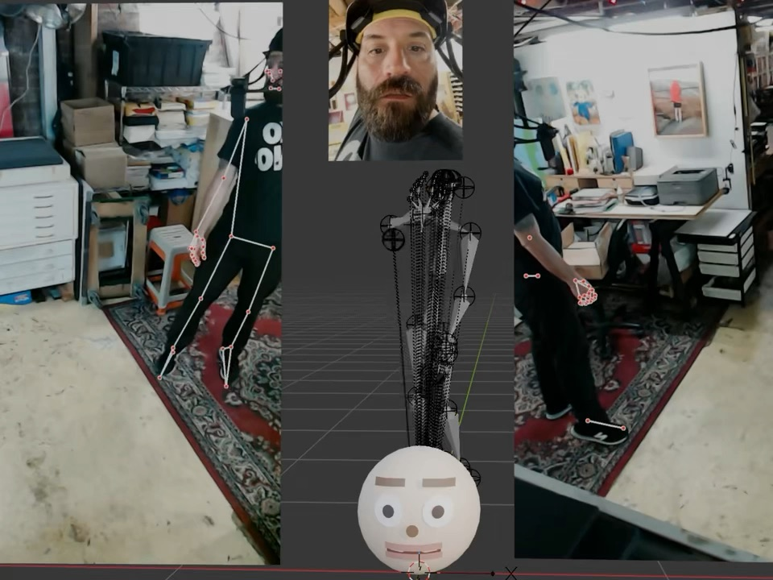
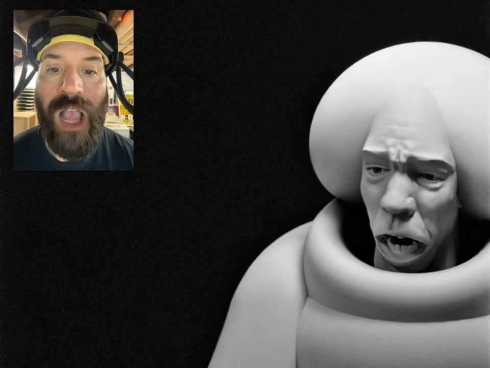

# HIHO Software

Free, open source motion capture and animation tools for classrooms, built in Blender.

   

<!--
DAVID, OPTIONAL HERO VIDEO: committed video files show as click-to-play links,
not inline players. For a video that plays right here at the top, edit this
file on GitHub.com and drag MEDIA/06.mov (the six-camera grid reel) into this
spot; GitHub uploads it and inserts an inline player automatically.
-->

Six webcams, one Blender addon, no subscriptions, no mocap suit: a school computer lab becomes a capture studio. This repository holds the software side of HIHO ("Human In, Human Out"), a program for time-based human work: storytelling, performance, animation, games, film, and sound. HIHO is a working name while the program chooses its permanent one.

This is a working repository, pre-1.0, developed in the open. First classroom testing is planned for Fall 2026 at SJSU. Expect honest rough edges.

## Watch the demo

A full walkthrough of the system, recorded for students: what it is, why it exists, the kit, and the whole workflow from calibration to a cleaned up animation on a rig.

Jump straight to a chapter:

- [0:00 Intro and what is HIHO Mocap](https://youtu.be/3x4TEfNW5bk)
- [2:57 Why build it and what makes it possible](https://youtu.be/3x4TEfNW5bk?t=177)
- [10:53 The kit: a ~$1,400 DIY setup](https://youtu.be/3x4TEfNW5bk?t=653)
- [15:25 The workflow: calibrate, record, bake, clean](https://youtu.be/3x4TEfNW5bk?t=925)
- [31:49 What is next and how to join](https://youtu.be/3x4TEfNW5bk?t=1909)

## Process pics

Click any picture to play its clip.

The animations above come from the studio practice of [David Bayus](https://www.davidbayus.zone), an artist working in San Francisco. He holds an MFA from the San Francisco Art Institute and is a Senior Lecturer in Digital Media Art at San Jose State University's CADRE Laboratory. His films and editions are held in collections including MoMA, the Whitney, and LACMA. Reach him at david.bayus@sjsu.edu. More of the work: [www.davidbayus.zone](https://www.davidbayus.zone)

## Why build it

This started out of a need in my own teaching practice: there was no workflow for teaching motion capture that did not push students into expensive equipment or permanent subscriptions.

If you know motion capture, there are really three avenues:

- **Suits.** Around two thousand dollars, and the software is subscription forever, so you never really own your hardware. And getting people to want to put on a suit in a classroom is its own problem.
- **Single camera AI tools.** Easy to use, but subscription again. One camera angle can never give a true, accurate translation of movement in 3D. And the newer tools solve motion generatively, which raises its own questions: where is that data coming from, and what are the ethics behind it?
- **Professional multicam.** Multiple cameras and a triangulation solve. The most accurate way to do this, which is why scientists and expensive film productions use it. Also the most expensive way to do this, with its own proprietary software, far beyond the means of an individual artist. Which is where I live.

Multicam is the right method. It just needed to stop costing more than a car. The breakthrough that makes that possible is FreeMoCap (see Engine and lineage below). HIHO Mocap is the artist layer built on top of it, focused on experimental animation and storytelling in Blender.

## The kit, about $1,400 total

Priced from the actual studio build. Nearly all of the cost is cameras, and you do not need to buy everything at once: the system works with a single $120 camera, just noisier. Every camera you add makes the capture cleaner. Most of these pieces cost about as much as a takeout order, so grab one a month, or go in on it with friends.

| Piece | Cost |
|---|---|
| Logitech webcams, up to six, recording 720p at 60 fps | about $120 each |
| Camera rig arms | about $20 each |
| 16 ft USB cables, good ones matter | about $30 each |
| Powered USB hubs, cameras only, two cameras per hub | about $52 each |
| Calibration board, printed big and mounted flat | $10 to 20, often free through school printing |
| Face capture helmet, optional | about $145 |

Plus a normal modern laptop. The studio machine is a stock MacBook Pro, nothing exotic. Everything the money buys is yours, and the software side is free forever.

## The workflow

Four moves, all inside Blender. The [demo](https://youtu.be/3x4TEfNW5bk?t=925) shows every one of them on a real take.

1. **Calibrate.** Every session, no exceptions, even when nothing looks like it moved. The board is a printed ChArUco pattern with 200 mm squares, larger than the usual recommendation, which measurably improved our accuracy and our floor. Walk the space with it for about a minute so at least two cameras always see it, then let the addon check the solve and score it honestly.
2. **Record.** The addon opens a live preview of every camera, a spoken countdown talks you in, and the take lands on disk with per frame timestamps.
3. **Bake.** The take processes through FreeMoCap from inside Blender. Preview the result, then bake it down to plain keyframes on every bone of a simple armature. From there it is just animation: no special rig, nothing proprietary.
4. **Clean.** A Butterworth smooth in the graph editor takes the jitter out. Smooth the hands and arms more, the core less, and never the root. Some shake in fingers and feet at 720p is par for the course, and it cleans up.

## What is here

| Project | What it does | Status |
|---|---|---|
| `HIHO_MOCAP/` | Multi-camera markerless motion capture addon for Blender. Record with a ring of webcams, process through FreeMoCap, get a baked animation on a rig. | Active, canonical (v1.4.43) |
| `UV_UNWRAPER/` | PaWrappa, one-click UV unwrapping for student sculpts. | Student-testing ready (v0.3.5) |
| `CADRE_REMESHER/` | Quadre, a quad remesher. A free alternative to paid remeshing tools. | Working (v0.3.0) |
| `green_room/` | Procedural character design toolkit. | Early, recently reactivated |
| `PPPARTY_V2/` | The single-camera era of the mocap work. | Parked (v2.0.4) |
| `PPPARTY_V1_ARCHIVE/` | The phone-era live puppet experiment that started it all. | Archived, read only |

## Human In, Human Out

The name is the policy. From the club newsletter:

> - Claude Opus helped write the code, but a human decided what to build and tested it
> - The capture system uses AI (Google's Mediapipe) to find your body, the input is from a real person moving
> - It never invents motion from a prompt
> - A human performs, designs the character, and tells the story
> - The AI is a tool in the middle, never the author

The same rule governs how this software is made. Every feature starts as a plain-language design document. Code is written in collaboration with AI (Claude), one tested change at a time, and a human decides what gets built, what ships, and what gets thrown away.

## How this was built

This repository documents itself in prose, not just commits. Every feature began as a dated design document, every bug hunt has a diagnosis writeup, and every research question has a research doc with its sources. More than a hundred of them live next to the code, and they are the real development history. Start with:

- `HIHO_MOCAP/STATUS.md` for the live state of the canonical project
- `HIHO_MOCAP/HIHO_MOCAP_WRAPPER_ARCHITECTURE.md` for the architecture and its reasoning
- the dated `*_DESIGN_*` and `*_RESEARCH_*` docs for every decision in between

The working rules: no code before design. One change at a time, one versioned build each, tested on a real capture before the next change begins. If a change makes things worse, it gets reverted, and the reversion is recorded too.

## The story so far

- **Spring 2026.** A phone-based live puppet experiment (PPParty V1) proves the appetite and hits the ceiling of one camera.

- **Summer 2026.** The multi-camera system (HIHO MOCAP) becomes the canonical project: a six-webcam ring, printed-board calibration with honest quality scoring, FreeMoCap processing in an external environment, and a bake-first artist workflow in Blender.
- **August 2026.** The first full [demo film](https://youtu.be/3x4TEfNW5bk), and open studio Fridays begin.
- **Fall 2026.** Students.

## Engine and lineage

The 3D solving engine is [FreeMoCap](https://freemocap.org) (AGPL-3.0), which runs in its own Python environment. This addon drives it and never modifies it. MediaPipe does the per-camera body tracking. The Blender addon is the artist layer: recording, calibration scoring, take loading, rig spawning, baking, and export.

What we have learned while driving FreeMoCap in a classroom, written up for their community with every claim sourced and dated: [`HIHO_MOCAP/UPSTREAM_NOTES_FOR_FREEMOCAP_2026-08-05.md`](HIHO_MOCAP/UPSTREAM_NOTES_FOR_FREEMOCAP_2026-08-05.md)

## Who makes this

HIHO software is built by [David Bayus](https://www.davidbayus.zone), an artist and Senior Lecturer in Digital Media Art at San Jose State University's CADRE Laboratory. The tools get their field testing in his studio practice before they reach students.

The studio runs open Fridays in San Francisco for students who want to record their own motion capture, two people per session. Ask first, through the Discord or an issue here.

Questions, ideas, or a classroom that wants in: open an issue right here.

## License

AGPL-3.0. Free and open source, forever.
